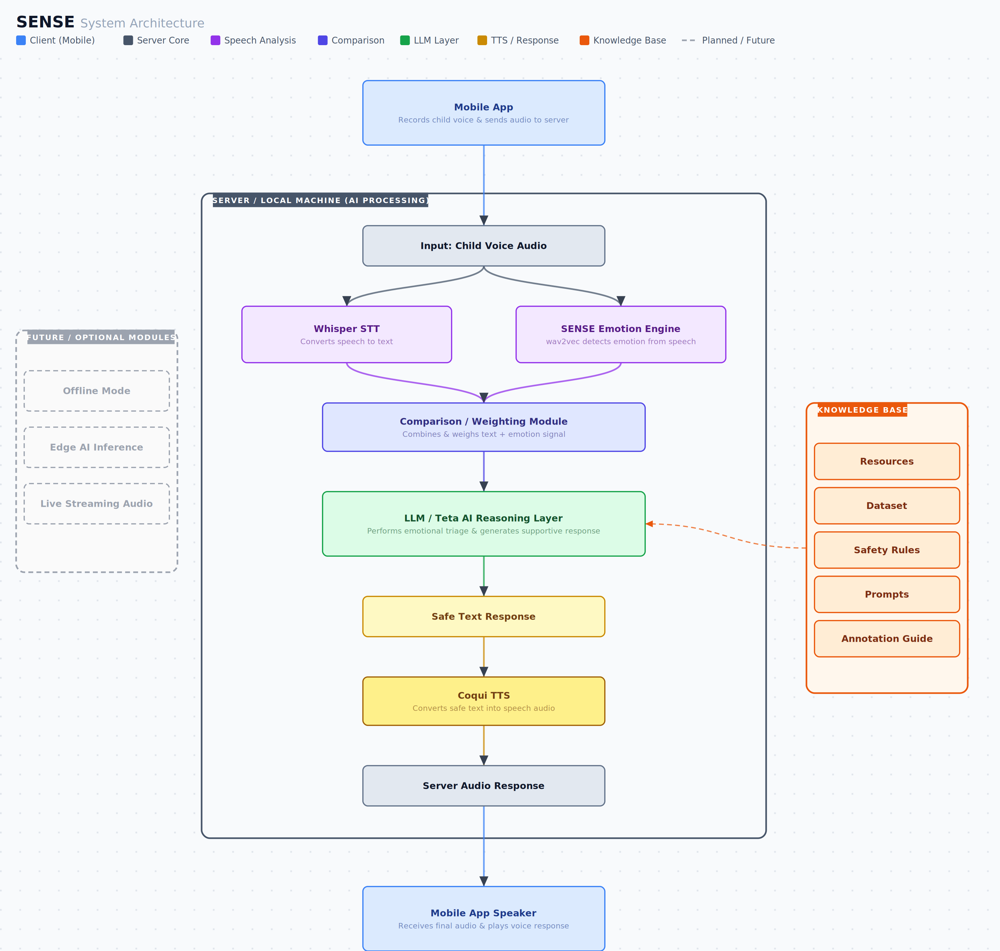

# SENSE — Speech Emotion and Neural Support Engine

**AI-powered emotional triage for Arabic-speaking children (ages 6–14) in crisis and post-conflict environments**, with deliberate focus on the Palestinian dialect.

> ⚠️ **SENSE performs triage, not diagnosis or therapy.** It classifies conversational turns into risk tiers so that human specialists can prioritize follow-up. It never replaces clinical judgment.

Graduation project — Birzeit University, ENCS5200 (Section 13)
Supervisor: Dr. Wasel Ghnanem
Team: Hamed Musleh (AI/Pipeline Lead) · Bara Mohsen (Backend) · Ahmad Zuhd (Mobile/Web)

---

## What SENSE does

A child speaks to **Teta** — a warm Palestinian-grandmother AI persona — through a mobile or web client. Each turn is:

1. **Transcribed** (`gpt-4o-transcribe`, dialect-tuned prompt)
2. **Triaged** into one of four tiers (rule-based analyzer, ~0.01s):
   - 🟢 **Safe / Regulated**
   - 🟡 **Distressed / Needs Support**
   - 🔴 **High Risk / Urgent**
   - ⚪ **Unclear / Need More Context**
3. **Answered** by Teta (`gpt-5` via Responses API + file_search RAG) — *except* High Risk turns,
   which **bypass the LLM entirely** and receive only pre-vetted hard-coded responses
4. **Spoken back** (`gpt-4o-mini-tts`, voice `coral`, 1.12× speed)

Measured end-to-end latency: **~13.75s/turn** (STT 3.5s · Triage 0.01s · LLM 7s · TTS 3s).

## System Architecture

A three-tier system communicating in a strictly layered fashion:


## Safety invariants (non-negotiable)

- **Zero dangerous downgrades**: any Red-labeled turn makes the whole session Red.
- **High Risk bypasses the LLM**: responses are pre-vetted and hard-coded.
- **Teta never claims to be human**, never uses therapeutic techniques (including breathing
  exercises), and refuses out-of-scope topics without naming them.
- **All clinical data artifacts require expert specialist review** (`needs_expert_review` flag).

## Repository layout

```
backend/            FastAPI server (routes, orchestrator, session manager, WebSocket)
  services/ai_adapter.py   ← single bridge to the AI pipeline (real/mock/hybrid)
ai_pipeline/        STT → triage → Teta reply → TTS
prompts/            Six authoritative prompt files (see docs/04_prompt_system.md)
resources/          RAG knowledge base (safety_rules.md, annotation_guide.md, ...)
datasets/           Gold test set + evaluation data
evaluation/         Metrics, confusion matrix, error analysis, leakage checks
sense_web.html      Browser client (MediaRecorder fallback for the Android emulator)
docs/               Project documentation
```

## Documentation index

| Doc | Contents |
|---|---|
| docs/01_architecture.md | System design, pipeline stages, data flow, design decisions |
| docs/02_setup.md | Installation, env vars, running locally & with Docker |
| docs/03_api_reference.md | 5 REST endpoints + WebSocket, request/response examples |
| docs/04_prompt_system.md | The six prompts, ownership rules, cross-prompt consistency |
| docs/05_evaluation.md | Gold set, metrics, leakage checks, reproducing results |
| docs/06_developer_guide.md | Adapter pattern, pipeline modes, contribution workflow |

## Quick start

```bash
git clone https://github.com/HamedMusleh/SENSE-Ai-Backend
cd SENSE-Ai-Backend
pip install -r requirements.txt
export OPENAI_API_KEY=sk-...        # PowerShell: $env:OPENAI_API_KEY="sk-..."
uvicorn backend.main:app --reload
# API docs: http://127.0.0.1:8000/docs
# Web client: open sense_web.html in a browser
```

## Known limitations (documented, not defects)

- **No Arabic child emotion speech dataset exists globally** — the audio emotion module
  (XLSR/wav2vec2) is disabled and retained as a placeholder (`{"source":"disabled_for_demo"}`).
  This is a research gap.
- **Android emulator microphone records silence** — platform limitation; use `sense_web.html`
  or a physical device.
- **Unseen-set overall accuracy is 41% by design**: the classifier escalates conservatively.
  The headline safety metric is **100% High Risk precision with zero dangerous downgrades**,
  not overall accuracy.
